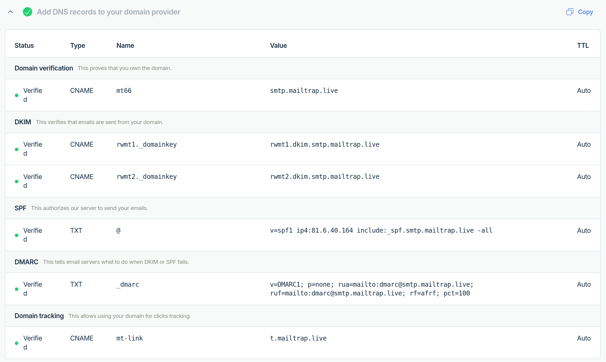

## run the app
```bash

```

## changes for the refactor to happen

compatibilities:
- mobile version

transfer:
- database synchronisation

design:

security:
- hack sicher (sql incections)
- .env file

app functionality:
- email notification problem (new email server)
- email notification when i accepted someone

file structure:
- better file structure
- api
- riesiges skript in mehrere kleinere aufteilen

coding style:
- more beautiful code

api? (jeder kann sein eigenes freundschaftsbuch machen mit gewissen parametern)

app für den app store

andere features:
- sprache ändern
- piselbilder generieren oder malen mit built-in drawing tool

tests!

readme mit explanation

try out my own css framework or just a different one

addextras like a pixelmonitor to draw and make illustrations

spread publicity

new favicon (install framework locally?, my own framework?)

admin account nicht als seperates scriptp und eine freundschaftsbuch mail-adresse


## used libraries an pricipals
- https://pypi.org/project/Flask-Mail/
- https://flask-mail.readthedocs.io/en/latest/ 
- https://mailtrap.io/blog/flask-email-sending/ (i used mailtrap for sending emails)
- email-records on cloudflare:



## all parts of the huge insane file:
- mail config
- init objects and database
- admin (route /admin)
- landing (/landing) index (/index) about(/about)
- login (/login) logout register (/register) delete_account reactivate_account
- waiting (/waiting)
- show_post post edit_post
- inject_has_post
- reset_password reset_form
- run.py


## mein code unter der lupe
- redirect(url_for('login')) = redirect('/login') --> tells flask to issue a redirect to the specified path
- url_for('login') -> looks up the url-path for the route function called login(), the template which the route-function renders wih render_tamplate
- render_template('login.html')

## key cncepts i have learned
Python Flask Library
- http-requests to certain routes is what triggers the route-functions, their return will be displayed on an html as the response

HTML
- ....

## meine errors und was man dagegen tun kann
- blueprint nicht richtig gehandelt mit den filenamen --> raise BuildError(endpoint, values, method, self)
werkzeug.routing.exceptions.BuildError: Could not build url for endpoint 'index'. Did you mean 'main.index' instead?


## bugs (todo)
- das base.html wird nicht geladen


## fragen
- wie funktioniert eigenlich django?